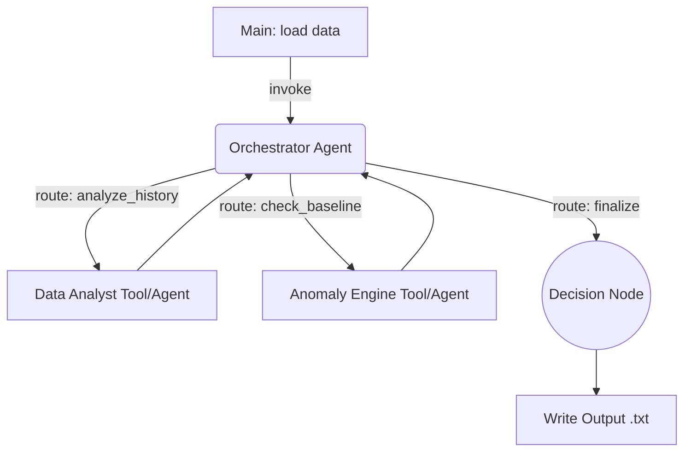

# Implementation - Reply Code Challenge 2026

This folder is the workspace for the actual competition solution written on challenge day (April 16th, 2026).

It is currently empty. Create your solution files here during the challenge.

---

## Architecture Blueprint

Based on sandbox training, here is the intended LangGraph architecture to implement:



**Key components:**
- **Model:** `meta-llama/llama-3.1-8b-instruct` (or whichever proved best in sandbox)
- **Temperature:** `0.1`
- **Pattern:** ReAct orchestrator breaking down the task, calling a pure Python `compare_baseline()` tool to compare the `personas.md` text against the `status.csv` metrics.

---

## Suggested structure

```
01_Implementation/
  README.md           - Architecture notes and run instructions
  main.py             - Entry point: LangGraph compile(), input feeding, output writing
  graph.py            - LangGraph node definitions and edge routing
  tools.py            - Analysis tools (e.g. bio-index trend calculator)
  utils.py            - (Symlink or copy of .scripts/utils.py for dataset loading)
```

Credentials: use the root .env file (one level above 02_AI_Agents_Challenge). Do not create a local .env here.
Dependencies: the root .venv already contains everything. Activate it with `source ../../.venv/bin/activate` or run `make` from the repo root if not yet set up.

---

## Before coding

Read the following files before writing any code:

1. ../00_How_It_Works/README.md - Rules, scoring, submission format, dataset unlock conditions
2. ../00_How_It_Works/api_guidelines.md - Langfuse integration, session ID generation, best practices
3. ../00_How_It_Works/model_whitelist.md - Choose your model by OpenRouter ID

The problem statement PDF will be available on the challenge platform on April 16th.

---

## Submission checklist

Training submissions (unlimited):
- Output file: UTF-8 plain text, format as specified in the problem statement
- Langfuse session ID: enter in the upload modal for every submission

Evaluation submissions (one per dataset, irreversible):
- Output file: same as training
- Langfuse session ID: required
- Source code zip: must contain all code, a requirements list, .env.example (not real .env), and instructions to reproduce the output

---

## Run instructions

Update this section when you have a working solution:

```bash
# Activate the root virtual environment (from repo root)
source .venv/bin/activate

# Or from this folder:
source ../../.venv/bin/activate

python main.py --level 1 --output output_lev1.txt
```
